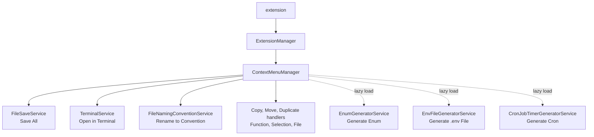

# Additional Context Menus - Technical Documentation

## 1. System Overview & Architecture

**High-level architecture summary:**
Additional Context Menus is a VS Code extension that extends the editor's right-click context menus with intelligent code operations and file-level workflows. It operates by registering commands and handlers through the VS Code Extension API.

**Data flow:**
When a user right-clicks and selects an extension command, VS Code invokes the corresponding command handler. The handler reads context from the `ProjectDetectionService` and `ConfigurationService`. If the command involves file parsing (e.g., function extraction), the lazy-loaded `CodeAnalysisService` uses the TypeScript Compiler API to extract the AST of the target file, locate the precise code boundaries, and execute the requested transformation. Code is then modified via the VS Code `WorkspaceEdit` API or transferred to the clipboard.

**Component boundaries:**

- **Frontend (UI):** VS Code UI (Context Menus, Quick Picks, Command Palette).
- **Backend (Extension Host):** Node.js runtime executing extension logic and TS Compiler API.
- **External Interfaces:** File system and VS Code integrated terminal.

**Architectural diagram:**

## 2. Codebase Structure & Modules

The repository is structured with separation of concerns in mind:

- `src/` - Contains all extension source code.
  - `commands/` - Contains class-based command handlers inheriting from `BaseCommandHandler`.
  - `services/` - Core logic services (e.g., file discovery, configuration, analysis).
  - `di/` - Dependency Injection container and service interfaces.
  - `managers/` - Orchestrates the extension lifecycle and inline command handlers.
  - `types/` - Shared TypeScript definitions.
  - `utils/` - Shared helpers (e.g., logging, metrics, caching).
- `public/` - Packaged extension assets such as images and icons.
- `test/` - Contains unit (`unit/`) and integration tests (`suite/`).

**Primary Modules:**

- `ExtensionManager`: The entry point that orchestrates startup and registers the `ContextMenuManager`.
- `ContextMenuManager`: Maps VS Code command IDs to their respective handler functions or classes.
- `CodeAnalysisService`: A specialized, lazy-loaded module containing the TypeScript compiler logic for AST manipulation.

## 3. Data Model & Storage

**Data Model:**
The extension does not persist data to a database. It operates on the in-memory AST representations of the user's codebase and relies on the file system as the source of truth.

**Caching Strategy:**
The `FileDiscoveryService` uses an in-memory cache to store discovered workspace files. This cache prevents redundant disk reads and has a configurable Time-To-Live (TTL) defined by `additionalContextMenus.fileDiscovery.cacheTTL` (default is 300,000 ms).

## 4. API & Interface Specifications

The primary API consists of VS Code Command IDs that users can trigger.

| Command ID                                    | Description                                              |
| --------------------------------------------- | -------------------------------------------------------- |
| `additionalContextMenus.copyFunction`         | Copies the AST-detected function at the cursor           |
| `additionalContextMenus.copySelectionToFile`  | Copies selected code and merges imports to a target file |
| `additionalContextMenus.saveAll`              | Saves all active editors with read-only handling         |
| `additionalContextMenus.renameFileConvention` | Renames files via the Explorer context menu              |

**Authentication:**
No authentication is required as this is a local development tool.

## 5. Local Development Setup & Configuration

**Setup Instructions:**

1. Clone the repository: `git clone https://github.com/Vijay431/additional-context-menus.git`
2. Navigate into the directory: `cd additional-context-menus`
3. Install dependencies: `pnpm install` (requires Node.js 22+ and pnpm)
4. Launch the extension: Open in VS Code and press `F5` to open the Extension Development Host.

**Environment Variables:**
There are no required `.env` variables for general development. GitHub Action workflows require `VSCE_PAT` and `OVSX_PAT` secrets for publishing.

## 6. Testing & Quality Assurance

- **Unit Tests (Vitest):** Run with `pnpm run test:unit`. Used for logic services and utilities that do not require the VS Code API.
- **Integration Tests (Mocha):** Run with `pnpm run test:integration`. These tests instantiate a real VS Code Extension Development Host to test end-to-end command execution.
- **Linting & Formatting:** Ensure code quality by running `pnpm run lint` and `pnpm run format` prior to committing.

## 7. Deployment & CI/CD Pipeline

**Build Process:**
The extension is bundled using `esbuild` for fast, tree-shaken builds via `pnpm run build`. The resulting artifacts are output to `dist/`.

**CI/CD (GitHub Actions):**

- **PRs:** Security checks (`pnpm audit`), linting, unit tests, and integration tests are run against a matrix of Node.js versions.
- **Releases:** Pushing a `v*` tag triggers the release workflow which runs `vsce package` and `ovsx publish`, releasing the extension to both the VS Code Marketplace and Open VSX Registry.

## 8. Troubleshooting & Edge Cases

1. **Large Files (AST Parsing):** Very large files (>10MB) can cause the `CodeAnalysisService` to become sluggish. The extension operates in the background, but heavy processing can temporarily delay context menu responses.
2. **Missing Framework Detection:** If a user opens a sub-folder that does not contain a `package.json`, framework context variables may not correctly populate. The extension falls back gracefully to standard generic operations.
3. **Write Conflicts during `SaveAll`:** Attempting to save all files when another process is locking a read-only file. The `FileSaveService` catches access errors and skips the locked file, logging the failure without crashing the batch save operation.
